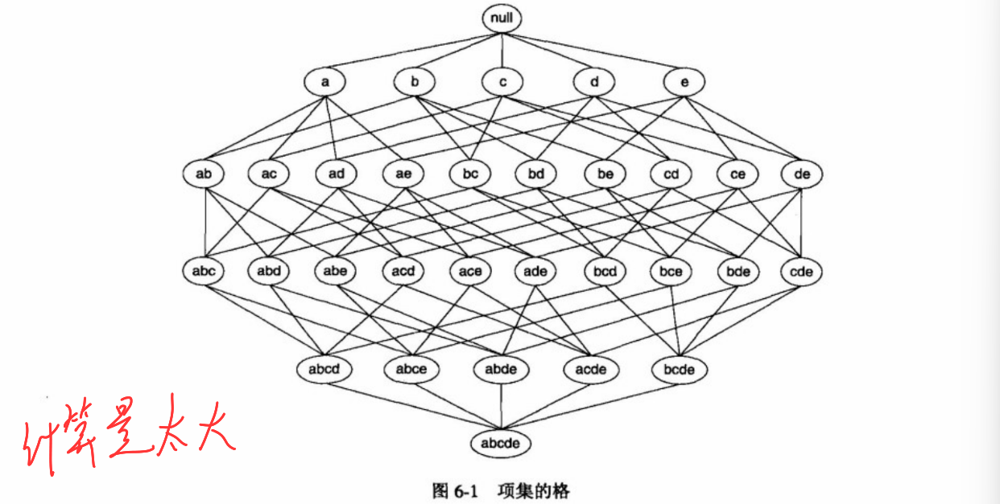
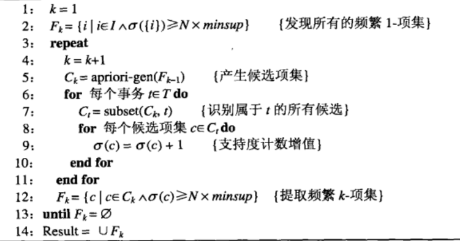
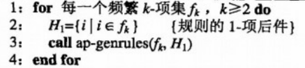
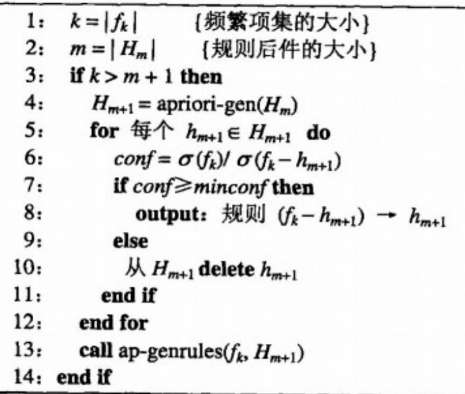
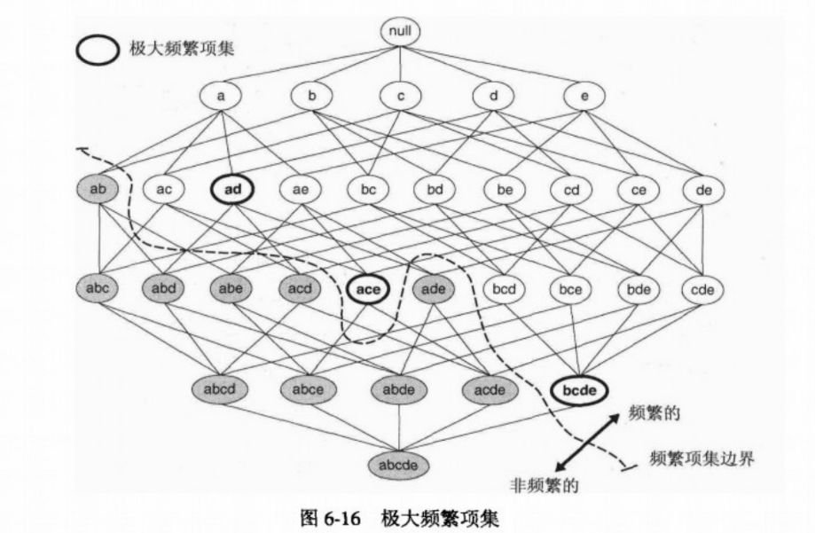
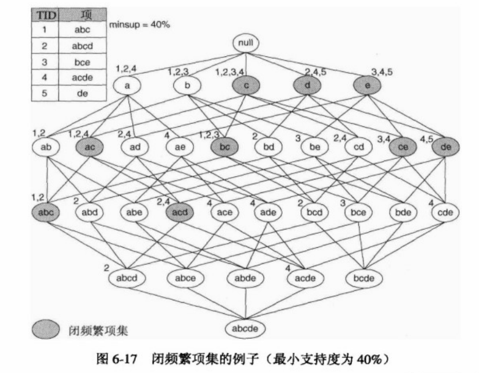
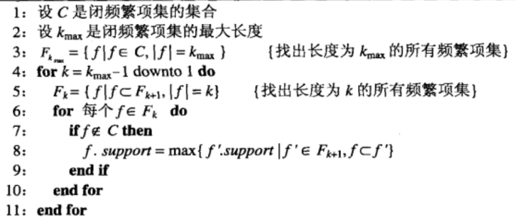
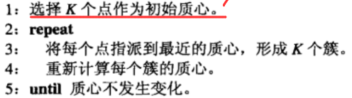
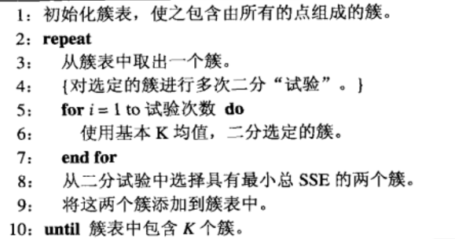
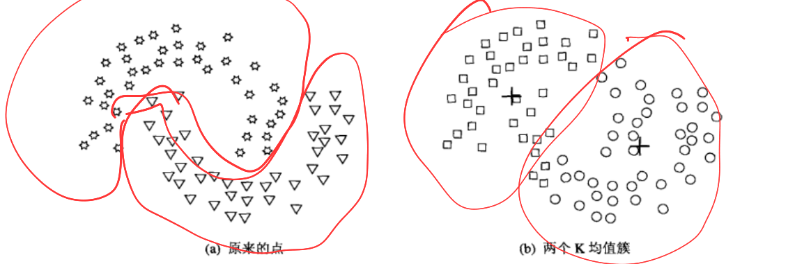

这是根据上课时提的内容所整理的内容，包含：分类、关联分析、聚类。如果有用的话希望能点个 Star。

[TOC]

------


# 1. 概述

数据挖掘将传统的数据分析方法与处理大量数据的复杂算法相结合，为探查和分析新的数据类型、运用新方法分析旧的数据类型提供了令人振奋的机会。


## 1.1 数据挖掘定义

数据挖掘是在大型数据存储库中，自动地发现有用信息的过程。数据挖掘是数据库中知识发现不可缺少的一部分，而知识发现是将未加工的数据转换为有用信息的整个过程。


## 1.2 数据挖掘中需要解决的问题

1. 可伸缩

	由于数据产生和收据技术的进步，数据集的规模越来越大。如果要处理这些海量数据集，则算法必须是可伸缩的。为了应对这一挑战，研究者开发了各种优化技术，如数据抽样、增量处理、并行和分布式计算等。


2. 高维性

	现在常常会遇到具有成百上千属性的数据集。为低维数据开发的传统的数据分析技术通常不能很好的处理这样的高维数据。此外，对于有的数据分析算法，随着维度的增加，计算复杂性迅速增加。


3. 异种数据和复杂数据

	通常，传统的数据分析方法只处理包含相同类型属性的数据集。但是近年来已经出现了更复杂的数据对象。因此需要考虑数据中的联系。


4. 数据的所有权与分布


5. 非传统（假设-检验模式）的分析

	传统的统计方法基于一种假设-检验模式。但是这一过程很复杂。


## 1.3 数据挖掘的任务

在数据挖掘中，任务大体上可以分为两类：预测与描述。预测是根据其他属性的值，预测特定属性的值；描述则是到处概括数据中潜在联系的模式，比如相关、趋势、聚类 、轨迹、异常等。

具体来说，数据挖掘的四种主要任务是：预测建模、关联分析、聚类分析、异常检测。

预测建模，涉及以说明变量函数的方式为目标变量建立模型。有两类预测建模任务：分类，用于预测离散的目标变量；回归，用于预测连续的目标变量。

关联分析，用来发现描述数据中强关联特征的模式。

聚类分析，旨在发现紧密相关的观测值组群，使得与属于不同簇的观测值相比，属于同一簇的观测值相互之间尽可能类似。

异常检测，主要是识别其特征显著不同于其他数据的观测值。


## 1.4 数据挖掘的应用

在数据挖掘方面的应用十分广泛，比如：市场分析管理、风险分析管理、欺骗检测、文本挖掘、数据流挖掘、Web 挖掘、DNA 数据分析等。


------


# 2. 数据

数据对于数据挖掘的成败至关重要。

## 2.1 数据类型

数据集的不同表现在多方面，例如：用来描述数据对象的属性可以具有不同类型。又或者数据集包含时间序列或者彼此之间具有明显联系的对象。数据类型决定了使用什么样的工具和技术来分析数据。


## 2.2 数据的质量

数据通常远非完美，尽管大部分数据挖掘技术可以忍受某种程度的数据不完美，但是注重理解和提高数据质量将改进分析结果的质量。通常必须解决的数据质量问题包括：噪声、离群点、数据遗漏、不一致、重复、偏差、无代表性等。


## 2.3 数据预处理

通常，数据需要加以处理才能适合于分析。预处理一方面是要提高数据的质量，另一方面要让数据更好的适应特定的数据挖掘技术或工具。


### 2.3.1 聚集

聚集将两个或者多个对象合并成单个对象。通过这样的数据归约，让开销更大的数据挖掘算法有使用可能。除此以外，通过高层数据视图，可以起到范围或者标度的转换。而且，对象或属性群的行为通常比单个对象或属性的行为更加稳定。但是利用聚集，也有可能导致细节的丢失。


### 2.3.2 抽样

抽样是选择数据对象子集的常用方法。在数据挖掘中，使用抽样是因为处理所有的数据成本太高，

抽样有许多方法，比如简单随机抽样和分层抽样。由于合适的样本容量不好确定，因此有时还会使用渐进抽样（自适应抽样）。


### 2.3.3 维规约

由于数据集可能会包含大量特征，而维归约可以删除不相关的特征并降低噪声，还能避免维灾难。因此维归约可以提升算法的表现。除此之外，维归约可以使模型更容易理解。而且，维归约可以让可视化更简单。

所谓的维灾难是指，随着数据维度的增加，许多数据分析变得更加困难。

而在维归约中，常常使用线性代数技术，将数据由高维空间投影至低维空间。比如主成分分析 PCA 算法。PCA 算法首先将数据标准化，然后计算数据的协方差矩阵、特征值、特征向量，根据特征值的大小选择特征向量，然后将其转换到新的空间中。

除此以外，还有奇异值分解 SVD 也用于维归约。


### 2.3.4 特征子集选择

降低维度的另一种方法是仅使用特征的一个子集，这可以从原始数据特征中选择出最相关的子集。有三种标准的特征选择方法：嵌入法、过滤法和包装法。

嵌入法在学习算法的训练过程中选择特征；过滤法依赖于数据特征的统计特性，与后续的学习算法无关；包装法通过选择不同的特征子集，并评估它们在特定学习算法上的性能来选择特征。


### 2.3.5 特征创建

特征创建通过创造新的数据来更有效地获取数据集中的信息。一般来说有三种方法：特征提取、映射数据到新的空间和特征构造。

特征提取是指由原始数据创建新的特征集；映射数据到新的空间是指将数据从原始空间转换到一个新的特征空间，比如傅里叶变换；特征构造是指基于现有数据创造新特征的过程。


### 2.3.6 离散化和二元化

有些数据挖掘算法，尤其是某些分类算法，要求数据是分类属性形式。发现关联模式的算法要求数据是二元属性格式。这时需要将连续属性变换成分类属性（离散化），也有可能要变换为二元属性（二元化）。

1. 二元化

	一种简单的分类属性二元化技术如下：如果存在 $m$ 个分类值，则将每个原始分类值唯一地映射到区间 $[0, m-1]$ 中的一个整数上。如果这些分类属性是有序的，则赋值过程必须保持原有的序关系。值得注意的是，即使属性原本已用整数表示，但如果这些整数不在区间 $[0, m-1]$ 中，这个映射过程仍然是必要的。

	接下来，将这 $m$ 个整数中的每一个都转换成对应的二进制数。由于需要 $n$ 位二进制数来表示这些整数，其中 $n$ 是满足 $2^n \ge m$ 的最小整数，因此每个分类值将被表示为一个 $n$ 位的二进制数。这样，原始的一个分类属性就被转换为了 $n$ 个二元属性，每个二元属性对应二进制数中的一位。

	但是，这样的分类也有可能导致复杂化，比如无意之中建立了转换后的属性之间的联系。

	同样，对于关联问题，可能需要用两个非对称的二元属性替换单个二元属性。

	

2. 连续属性离散化

	通常，离散化用于在分类或关联分析中使用到的属性上。一般来说，离散化的效果取决于所使用的算法，以及用到的其他属性。然而，属性离散化通常单独考虑。

	连续属性变换成分类属性设计两个任务：决定需要多少分类，以及确定如何映射这些分类值。在用于分类的离散化方法中，使用类信息的是监督离散化，不使用的则是非监督离散化。如果不使用类信息，则可能会使用等宽、等频率、等深等方法来划分。

	而监督离散化往往能产生更好的结果。在这其中，基于熵的方法是最有前途的离散化方法之一。它通过计算和比较不同划分方案下的信息熵来确定最优的区间划分，从而将连续属性转换为离散属性。


### 2.3.7 变量变换

变量变换是指用于变量的所有值的变换。在这里主要有两种方法：简单函数变换和规范化。我们主要讨论的是标准化或者规范化。

标准化或者规范化的目标是使整个值的集合具有特定的性质，比如对变量的标准化公式 $ x = \frac{(x' - \bar{x})}{s_x} $ 可以创建一个均值为 0 、标准差为 1 的变量，从而避免影响最终结果。由于均值和标准差受到离群点影响很大，因此常常需要用中位数替代均值，用绝对标准差取代标准差。


## 2.4 根据数据联系分析数据

数据分析的一种方法是找出数据对象之间的联系，之后使用这些联系，而不是数据对象本身来对其进行分析。在很多情况下，当我们计算出数据之间的相似性或者相异性之后，就不需要原始数据了。我们使用术语邻近度来表示相似性或者相异性。


### 2.4.1 数据对象之间的相异度、相似度

在这里将从距离开始逐步讨论相异度的问题。

我们知道，欧几里得距离为：$ d(P, Q) = \sqrt{(x_2 - x_1)^2 + (y_2 - y_1)^2 + (z_2 - z_1)^2 + \ldots} $ 。而闵可夫斯基距离为： $D(P, Q) = \left( \sum_{i=1}^{n} |x_{i, P} - x_{i, Q}|^p \right)^{\frac{1}{p}}$ 。他们都满足非负性、对称性、三角不等式这三个性质。我们将满足这三个性质的测度称为度量。有些人对只满足这三个性质的相异性度量使用术语“距离”，但是在实践中往往违反这一约定。

许多相异度都不满足一个或者多个度量性质。而对于相似度，他们通常会满足对称性和非负性，尽管也通常不满足三角不等式。


### 2.4.2 邻近性度量

在这里，给出一些计算相似度的方法。

1. 二元数据的相似性度量

两个仅包含二元属性的对象之间的相似性度量也称为相似系数，并且通常是在 0 和 1 之间取值。0 表明对象完全不相似，1 表明完全相似。

假设有两个对象 x 和 y ，都由 n 个二元属性组成，这样两个对象比较可以生成如下四个量：$f_{00}$= x 取 0 并且 y 取 0 的属性个数，$f_{01}$ = x 取 0 并且 y 取 1 的属性个数，$f_{10}$ = x 取 1 并且 y 取 0 的属性个数，$f_{11}$ = x 取 1 并且 y 取 1 的属性个数。

一种常用的相似系数是简单匹配系数，定义如下：
$$
SMC = \frac{值匹配的属性个数}{属性个数}= \frac{f_{11} + f_{00}}{f_{01} + f_{10} + f_{11} + f_{00}}
$$
而 Jaccard 系数则是用来处理仅包含非对称二元属性的对象，定义如下：
$$
J = \frac{匹配的个数}{不涉及00匹配的属性个数}=\frac{f_{11}}{f_{01}+f_{10}+f_{11}}
$$
Jaccard 系数只计算正匹配的情况，使得其适合用于稀疏数据，或者非对称二元数据。


2. 余弦相似度

通常，文档用向量表示，向量的每个属性代表一个特定的词在文档中出现的频率。对于文档来说，其相似性度量不仅应当需要忽略 0-0 匹配，还要处理非二元向量。因此在文档相似性中，最常用的是余弦相似度。假设 x 和 y 是两个文档向量，则有：
$$
\cos { ( \vec{x},\vec{y} ) } = \frac{\vec{x} \cdot \vec{y}}{||\vec{x}|| \space ||\vec{y}||  }
$$
余弦相似度衡量的是两个向量在方向上的相似程度，而不考虑它们的大小。它的值介于-1和1之间，其中1表示两个向量方向完全相同，-1表示两个向量方向完全相反，0表示两个向量正交（无相关性）。


3. 广义 Jaccard 系数

广义 Jaccard 系数可以用来处理文档数据，并在二元属性情况下归约为 Jaccard 系数。定义如下：
$$
EJ(\vec{x},\vec{y})=\frac{\vec{x} \cdot \vec{y}}{||\vec{x}||^2+||\vec{y}||^2-\vec{x} \cdot \vec{y} }
$$


4. 皮尔森相关系数

两个数据对象 x 和 y 之间的皮尔森相关可以由下式定义：
$$
corr_{xy} = \frac{cov(x, y)}{\sigma_x \sigma_y}
$$
其中：$cov(x, y)$ 是 $x$ 和 $y$ 的协方差，表示为 $cov(x, y) = \frac{1}{n-1}\sum_{k=1}^{n} (x_k - \bar{x})(y_k - \bar{y})$，这里 $\bar{x}$ 和 $\bar{y}$ 分别是 $x$ 和 $y$ 的平均值。$\sigma_x$ 和 $\sigma_y$ 分别是 $x$ 和 $y$ 的标准差，分别计算为 $\sigma_x = \sqrt{\frac{1}{n-1}\sum_{k=1}^{n} (x_k - \bar{x})^2}$ 和 $\sigma_y = \sqrt{\frac{1}{n-1}\sum_{k=1}^{n} (y_k - \bar{y})^2}$。$r_{xy}$ 是 $x$ 和 $y$ 之间的皮尔森相关系数。

皮尔森相关系数衡量两个变量之间的线性关系强度。系数值介于 -1（完全负相关）和 1（完全正相关）之间，0 表示没有线性相关。


------


# 3. 分类算法

分类任务就是确定对象属于哪个预定义的目标类。在这里，我们主要聚焦于“决策树归纳”这一技术。

## 3.1 决策树归纳

### 3.1.1 决策树的工作原理

决策树是一种由结点和有向边组成的层次结构，它通过算法在每个结点做出决策，从而选择适当的分支。


### 3.1.2 如何建立决策树

由于搜索空间是指数规模的，因此找出最佳决策树在计算上是不可行的。因此，需要来利用算法来找出具有一定准确率的次最优决策树。Hunt 算法就是这样一种算法，他是许多决策树算法的基础。

在 Hunt 算法中，通过将训练记录相继划分成较纯的自己，以递归的方式建立决策树。设 $ D_t $ 是与结点 $ t $ 相关联的训练记录集，而 $ y = \{y_1, y_2, \ldots, y_c\} $ 是类标号，Hunt算法的递归定义如下：

- 如果 $ D_t $ 中所有记录都属于同一个类 $ y_t $，则 $ t $ 是叶结点，用 $ y_t $ 标记。
- 如果 $ D_t $ 中包含属于多个类的记录，则选择一个属性测试条件，将记录划分成较小的子集。对于测试条件的每个输出，创建一个子女结点，并根据测试结果将 $ D_t $ 中的记录分布到子女结点中。然后，对于每个子女结点，递归地调用该算法。


### 3.1.3 表示属性测试条件的方法

决策树归纳算法需要为不同类型的属性，提供属性测试条件以及对应输出的方法。

二元属性：二元属性的测试条件会产生两个可能的输出。

标称属性：标称属性的测试条件可以是多路划分，也可以是二元划分。

序数属性：序数属性也可以产生二元或多路划分，只要不违背序数属性值的有序性。

连续属性：对于连续属性，测试条件可以是具有二元输出的比较测试，也可以是输出的范围查询。


### 3.1.4 选择最佳划分的度量

选择最佳划分的度量通常是根据划分后子女节点不纯性的程度。不纯的程度越低，类分布就越倾斜。

不纯性度量的方法有如下几种：

基于熵：

不纯性度量是用于决策树算法中评估节点的纯度的方法。节点的纯度指的是该节点中数据的同质性。以下是几种常用的不纯性度量方法：

信息熵：节点的熵越低，表示数据的纯度越高。
$$
H(T) = -\sum_{i=0}^{c-1} p(i|t) \log_2 p(i|t)
$$
基尼不纯度：
$$
G(T) = 1 - \sum_{i=0}^{c-1} [p(i|t)]^2
$$
误分类率：
$$
E(T) = 1 - \max_i [(p(i|t)]
$$
其中，$c$ 为类的个数，$Olog_20 = 0$。 

为了确定测试条件的效果，我们需要比较划分前与划分后的不良纯度，他们的差越大，测试条件的效果就越好。增益 $\Delta$ 就是一种用来确定划分效果的标准，其公式如下：
$$
\Delta = I(parent) - \sum_{j=1}^{k}\frac{N(\nu_j)}{N}I(\nu_j) 
$$
其中，$I(.)$ 是给定节点的不纯性度量，$N$ 是父节点上记录总数，$k$ 是属性值的个数，$N(\nu_j)$ 是与子女节点 $\nu_j$ 相关联的记录个数。决策树归纳算法通常选择最大化 $\Delta$ 的测试条件。当选择熵作为作为不纯性度量的时候，熵的差就是所谓的信息增益 $\Delta_{info}$ 。


### 3.1.5 决策树归纳算法

决策树归纳算法的伪代码如下：

```yaml
TreeGrowth(E, F)
1: if stopping_cond(E, F) = true then
2:     leaf = createNode()
3:     leaf.label = Classify(E)
4:     return leaf
5: else
6:     root = createNode()
7:     root.test_cond = find_best_split(E, F)
8:     令 V = {v | v 是 root.test_cond 的一个可能的输出}
9:     for 每个 v ∈ V do
10:        Ev = {e | root.test_cond(e) = v 并且 e ∈ E}
11:        child = TreeGrowth(Ev, F)
12:        将 child 作为 root 的派生结点添加到树中，并将边 (root → child) 标记为 v
13:    end for
14: end if
15: return root

```

**函数 `createNode()`**为决策树建立新结点。决策树的结点可以是一个测试条件，记作 `node.test_cond`，或者是一个类标号，记作 `node.label`。

**函数 `find_best_split()`**确定应当选择哪个属性作为划分训练记录的测试条件。测试条件的选择取决于使用哪种不纯性度量来评估划分，一些广泛使用的度量包括熵、Gini指标和 χ²（卡方）统计量。

**函数 `Classify()`**为叶结点确定类标号。对于每个叶结点 $ t $，令 $ p(t) $ 表示该结点上属于类 $ i $ 的训练记录所占的比例。在大多数情况下，都将叶结点指派到具有多数记录的类：`leaf.label = argmax p(i|t)`。其中，操作 `argmax` 返回最大化 $ p(t) $ 的参数值 $ i $。$ p(i|t) $ 除了提供确定叶结点类标号所需要的信息之外，还可以用来估计分配到叶结点 $ t $ 的记录属于类 $ i $ 的概率。

**函数 `stopping_cond()`**通过检查是否所有的记录都属于同一个类，或者都具有相同的属性值，决定是否终止决策树的增长。终止递归函数的另一种方法是，检查记录数是否小于某个最小阈值。


------


# 4. 关联分析算法

关联分析用于发现隐藏在大型数据集中有意义的联系。所发现的联系可以用关联规则，或者频繁项集的形式表示。

## 4.1 产生频繁项集

### 4.1.1 格结构与先验原理

格结构往往被用来枚举所有可能的项集。一般来说，一个包含 $k$ 个项的数据集可能产生 $2^k-1$ 个频繁项集，不包含空集在内。由于在实际应用中 $k$ 可能很大，因此需要探查的项集搜索空间是指数规模的。



发现频繁项集的一种原始方法是确定格结构中每个候选项集的支持度计数。但是这样开销很大，因此需要通过减少候选集的数目，或者减少比较次数来降低计算的复杂度。

我们知道，如果一个项集是频繁的，那么它的所有子集也一定是频繁的；相反，如果项集是非频繁的，那么它的所有超集也一定是非频繁的。因此我们可以说，如果发现一个项集是非频繁的，那么我们可以立即对包含它的超集的子图进行剪枝。这种基于支持度度量修剪指数搜索空间的策略，就称为基于支持度的剪枝。这种策略依赖于支持度度量的一个关键性质，即一个项集的支持度绝不会超过它的子集的支持度。这个性质也被称为支持度向量的反单调性。


### 4.1.2 Apriori 算法

Apriori 算法是第一个关联规则挖掘算法，它开创性的使用基于支持度的剪枝技术，系统地控制候选项集指数增长。



该算法初始时单次扫描数据集，确定每个项的支持度，然后得到所有频繁 1-项集的集合。然后将使用上一次迭代发现的频繁 (k-1)-项集，产生新的候选 k-项集。候选的产生使用 apriori-gen 函数实现。通过遍历所有事务 t 来计算每个候选项集的支持度，当没有更多频繁项集的时候，算法终止。


### 4.1.3 候选的产生与剪枝

而对于 apriori-gen 函数，具体来说，它通过以下两个操作来产生候选项集：

1、候选项集的产生：该操作由前一次迭代发现的频繁 (k-1)-项集来产生新的候选 k-项集，

2、候选项集的剪枝：该操作采用基于支持度的剪枝策略，删除一些候选 k-项集。


理论上来说，存在很多候选集产生的方法，下面简要介绍几种。

1. 蛮力方法：把所有的 k-项集都看作可能的候选，然后使用候选剪枝去除不必要的候选。

2. $F_{k-1} \times F_1$ 方法：通过合并频繁 (k-1)-项集和频繁 1-项集生成和剪枝候选 k-项集。

3. $F_{k-1} \times F_{k-1}$ 方法：通过合并一对频繁 (k-1)-项集生成和剪枝候选 k-项集。

   

### 4.1.4 支持度计数

支持度计数过程确定在 apriori-gen 函数的候选项剪枝步骤保留生下来的每个候选项集出现的频繁程度。支持度计数的一种方法是，将每个事务与所有的候选项集进行比较，并且更新包含在事务中的候选项集的支持度计数。但是这种方法计算起来很复杂。

另一种方法是枚举每个事务所包含的项集，并且利用它们更新对应的候选项集的支持度。

在 Apriori 算法中，候选项集被划分为不同的桶，并存放在 Hash 树中。在支持度计数期间，包含在事务中的项集也散列到相应的桶中。


## 4.3 规则产生

在这里，我们开始讨论如何有效的从给定频繁项集中提取关联规则。忽略那些前件或后件为空的规则，每个频繁 k-项集能够产生 $2^k-2$ 个关联规则。


### 4.3.1 基于置信度的剪枝

不像支持度度量，置信度不具有任何单调性。但是当比较由频繁项集 Y 产生的规则时，下面的定理对于置信度度量成立：

**如果规则 $X \to Y -X$ 不满足置信度阈值，则形如 $X' \to Y-X'$ 的规则一定也不满足置信度阈值，其中 $X'$ 是 $X$ 的子集。** 


### 4.3.2 Apriori 算法中规则的产生

Apriori 算法使用一种逐层方法来产生关联规则，其中每层对应于规则后件中的项数。初始时，提取规则后件只含一个项的所有高置信度规则，然后使用这些规则来产生新的候选规则。

下面是关联规则产生的伪代码。



其中 ap-genrules 函数定义如下，它的过程与频繁项集产生的过程类似，唯一的不同是，在规则产生时，不必再次扫描数据集来计算候选规则的置信度，而是使用在频繁项集产生时计算的支持度计数来确定每个规则的置信度。




## 4.4 频繁项集的紧凑表示

在实际中，产生的频繁项集可能会非常大，因此需要推导出较小的频繁项集是有必要的。下面将介绍两种具有代表性的项集。


### 4.4.1 极大频繁项集

极大频繁项集，是一个直接超集都不频繁的频繁项集。



极大频繁项集形成了可以到处所有频繁项集的最小的项集的集合，但是不包含他们子集的支持度信息。在某些情况下，可能需要得到保持支持度信息的频繁项集的最小表示，这就需要闭频繁项集。


### 4.4.2 闭频繁项集

闭项集提供了频繁项集的一种最小表示，该表示不丢失支持度信息。如果一个项集 X 的直接超集都不具有和它相同的支持度计数，那我们称这个项集是闭的。

换句话说，就是如果至少存在一个 X 的直接超集，其支持度计数与 X 相同，X 就不是闭的。



而如果一个项集是闭的，并且它的支持度大于等于最小支持度阈值，那么我们就称其为闭频繁项集。在这里，可以得出结论：最大闭频繁项集 ∈ 闭频繁项集 ∈ 频繁项集。

使用频繁项集进行支持度计数的算法如下：




## 4.5 兴趣度的客观度量

客观度量是一种评估关联模式质量的数据驱动的方法。


### 4.5.1 支持度-置信度框架的局限性

现有的关联规则的挖掘算法需要使用支持度和置信度来除去没有意义的模式。然而置信度的缺陷在于该度量忽略了规则后件中项集的支持度。因此现在有各种客观度量用来评估关联模式。


### 4.5.2 兴趣因子

由于置信度度量忽略了规则后件中出现的项集的支持度，高置信度的规则有时可能出现误导。解决这一问题的方法是使用一种称为提升度的度量：
$$
lift(A \to B) = \frac{c(A \to B)}{S(B)}
$$
它计算规则置信度和规则后件中项集的支持度之间的比率。对于二元变量，提升度等价于另一种称为兴趣因子的客观度量：
$$

I(A,B) = \frac{s(A,B)}{s(A) \times s(B)} = \frac{Nf_{11}}{f_{1+}f_{+1}} \\
$$
该度量可以解释如下：
$$
I(A, B) = \left\{ 
\begin{array}{ll} 
=1 & \text{如果 } A \text{ 和 } B \text{ 是独立的} \\
>1 & \text{如果 } A \text{ 和 } B \text{ 是正相关的} \\
<1 & \text{如果 } A \text{ 和 } B \text{ 是负相关的} 
\end{array} 
\right.
$$
但是兴趣因子也有局限性。它可能忽略基础概率、对罕见项过度强调、缺乏方向性，并可能因数据集特性而不总是适用或可能导致误导。


### 4.5.3 相关分析

相关分析是分析一对变量之间关系的基于统计学的技术。对于二元变量，相关度的定义如下：
$$
\phi = \frac{ f_{11}f_{00} - f_{01}f_{10} }{\sqrt{ f_{1+} f_{+1} f_{0+} f_{+0} } }
$$
同样的，相关分析也有局限性。它更适合分析对称的二元变量，而且当样本大小成比例变化的时候，它不能保持不变。


### 4.5.4 IS 度量

IS 度量是用于处理非对称二元变量的，定义如下：
$$
IS(A,B) = \sqrt{ I(A,B) \times s(A,B) } = \frac{s(A,B)}{\sqrt{s(A)s(B)}}
$$
因为 IS 值取决于 $s(A)$ 和 $s(B)$ ，因此 IS 存在与置信度度量类似的问题：即使是不相关或者负相关的模式，度量值也可能相当大。


### 4.5.5 其他度量

除了上述度量之外，还存在一些其他的度量方法。对于项集 $\{ A,B \}$ 的对称客观度量有：相关性 $\phi$ 、几率 $\alpha$ 、$k$ 、兴趣因子 $I$ 等。而对于规则 $A \to B$ 的非对称客观度量则有 Goodman-Kruskal $\lambda$ ，互信量 $M$、J 度量 $J$等。


## 4.6 倾斜支持度分布分布的影响

许多关联分析算法的性能受到输入数据的性质的影响。选择合适的支持度阈值挖掘可能会相当棘手，而且可能会提取出大量的虚假模式。这样的模式就是所谓的交叉支持模式。

而现有的支持度、置信度都无法消除交叉支持模式。置信度剪裁也无济于事，因为由交叉支持模式提取的规则的置信度可能很高。

但是，可以通过检查由给定项集提取的最低置信度规则来检测交叉支持模式。我们称其为全置信度度量：
$$
\text{h-confidence}(X) \le \frac{\min[s(i_1), s(i_2), \ldots, s(i_k)]}{\max[s(i_1), s(i_2), \ldots, s(i_k)]}
$$
当确保模式的置信度超过全置信度，就能确保消除交叉支持模式。


------


# 5. 聚类分析算法

聚类分析将数据划分成有意义或者有用的组（簇）。如果目标是划分成有意义的组，则簇应当捕获数据的自然结构。聚类还可以是解决其他问题的起点。

在这里，我们主要讨论 K 均值、凝聚的层次聚类以及 DBSCAN 算法。


## 5.1 K-means 算法

K 均值是基于原型的、划分的聚类技术。它试图发现用户指定个数 K 的簇（用质心代表）。


## 5.1.1 基本 K 均值算法

K 均值的算法比较简单。它从选择K个初始质心开始（K是预定的簇数），然后将每个点指派给最近的质心形成簇，接着基于簇中点的分布更新质心位置，重复这个过程直到簇或质心不再变化。

下面给出的是 K 均值算法的伪代码：



在这里，为了将点指派到最近的质心，需要采用邻近性度量来量化“最近”的概念。比如在欧氏空间中，使用欧几里得距离，在文档中使用余弦相似度等。

我们知道，质心会随着数据邻近性度量和聚类目标不同而改变。聚类的目标常常用一个目标函数表示。当选定了邻近性度量和目标函数，质心就可以确定。下面给出几个目标函数的例子：

1. 欧几里得空间中的数据

   在欧几里得空间中，使用误差的平方和 SSE 作为度量聚类质量的目标函数：
   $$
   SSE = \sum_{i=1}^{K} \sum_{x \in C_i}^{} dist(c_i,x)^2
   $$
   其中 $dist$ 是欧氏距离。

   同时也可以得到第 $i$ 个簇的质心：
   $$
   c_i = \frac{1}{m_i} \sum_{x \in C_i}^{}\mathbf{x}
   $$
   

2. 文档数据

   K 均值并不局限于欧氏空间的数据，也适用于文档数据以及余弦相似度。对于文档来说，需要最大化簇中文档与簇的质心的相似性，我们称其为凝聚度：
   $$
   \text{Total Cohesion} = \sum_{i=1}^{K}\sum_{x \in C_i}cosine(\mathbf{x,c_i})
   $$
   

   K 均值也有一些附加的问题，比如如何处理空簇、如何识别离群点、以及如何降低 SSE 等。


### 5.1.2 二分 K 均值

二分 K 均值算法是基本 K 均值算法的直接扩充：




### 5.1.3 K 均值和不同的簇类型

当簇出现非常态的形状的时候，K 均值很难检测到”自然的“簇。



K 均值仅限具有中心概念的数据。尽管 K 中心点聚类技术没有这种限制，但开销更大。


## 5.2 凝聚的层次聚类算法

层次聚类技术是第二类重要的聚类方法。这种聚类方法涉及一组密切相关的聚类技术。有两种产生聚类的方法。

凝聚的：从点作为个体簇开始，每一步合并两个最接近的簇。这需要定义簇的邻近性概念。

分裂的：从包含所有点的某个簇开始，每一步分裂一个簇，直到仅身下一个单点簇。在这种情况下，我们需要确定每一步分裂哪个簇，以及如何分裂。


## 5.3 DBSCAN 算法

这是一种产生划分聚类的基于密度的聚类算法，簇的个数由算法自动确定。

